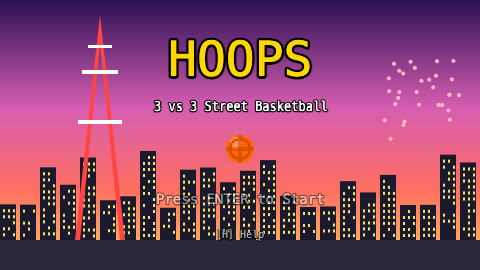
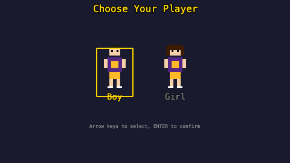
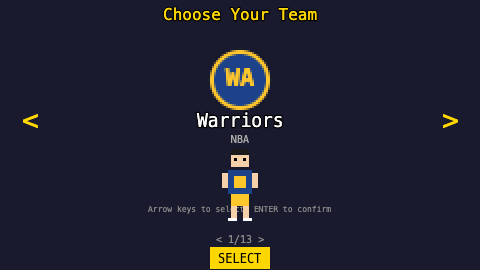
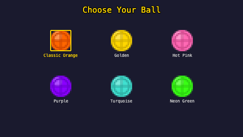
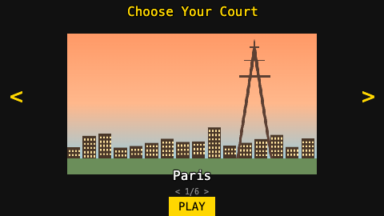
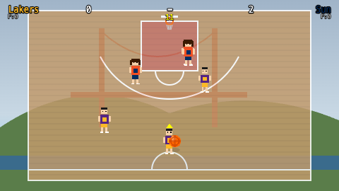

# Hoops

A pixel-art 3v3 street basketball game built entirely in the browser with [Phaser 3](https://phaser.io/).



## Features

- **3v3 half-court basketball** — first to 20 wins
- **13 NBA & WNBA teams** — Lakers, Celtics, Bulls, Warriors, Heat, Nets, Aces, Storm, Liberty, Sun, Lynx, Mercury, Valkyries
- **6 ball colors** — Classic Orange, Golden, Hot Pink, Purple, Turquoise, Neon Green
- **6 landmark courts** — Paris, San Francisco, Berlin, Tokyo, Rio de Janeiro, New York
- **AI opponents** with man-to-man defense, help defense, pass interceptions, and ball pressure
- **Easy & Hard difficulty** — choose before each game; Hard adds steals, shot contests, and defensive pressure
- **Fouls, free throws, shot clock** and check-ball rules
- **Smooth post-basket transitions** — players walk to position with OFFENSE!/DEFENSE! callouts
- **Tutorial tips** — contextual hints during your first few possessions
- **Touch controls** for mobile/tablet with virtual joystick (tap to switch, hold to steal)
- **Synthesized sound effects** via Web Audio API (no audio files)
- **Zero dependencies** — single HTML file, all assets procedurally generated

## Screenshots

| Customize | Team | Ball | Court |
|:-:|:-:|:-:|:-:|
|  |  |  |  |

### Gameplay



## How to Play

Open `index.html` in any modern browser. For the best experience, serve it locally:

```bash
python3 -m http.server 8080
# then open http://localhost:8080
```

### Controls

#### Keyboard (Desktop)

| Key | Action |
|-----|--------|
| Arrow keys / WASD | Move |
| SPACE | Shoot (hold to charge, release to shoot) |
| X | Pass |
| Z | Switch player (defense) / Call screen (offense) |
| C | Steal (defense) / Juke (offense) |
| SHIFT | Sprint |
| ENTER | Confirm |
| ESC | Pause / Back |

#### Touch (Mobile / Tablet)

Virtual joystick on the bottom-left for movement. Action buttons on the bottom-right for shooting, passing, and switching players.

## Tech Stack

- **Engine**: Phaser 3 (via CDN)
- **Physics**: Phaser Arcade Physics
- **Assets**: Procedurally generated pixel art using Canvas API
- **Sound**: Web Audio API synthesis
- **Resolution**: 480 x 270, scaled to fit viewport

## License

MIT
